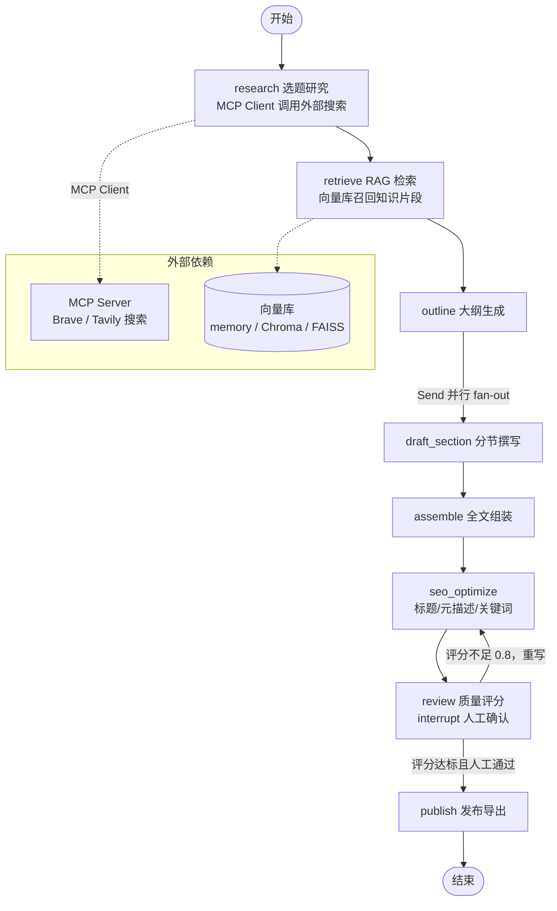

# LangGraph SEO Blog

基于 **LangGraph** 的 AI SEO 博客生成器：输入一个主题，自动完成选题研究、知识库检索（RAG）、大纲规划、分节并行撰写、SEO 优化、质量审查（含人工介入）直到发布导出的完整工作流。


## ✨ 功能特性

- **完整的 LangGraph 状态机工作流**：选题研究 → RAG 检索 → 大纲生成 → 分节并行撰写 → 全文组装 → SEO 优化 → 质量审查 → 发布导出
- **条件边与循环重写**：质量评分不达标自动回到 SEO 优化节点重写，直到达标为止
- **Human-in-the-loop**：文章质量达标后通过 `interrupt` 暂停执行，等待人工确认再发布
- **Checkpointer 断点续跑**：基于线程（`thread_id`）保存执行快照，中断后可恢复，天然支持多轮记忆
- **并行分节撰写**：基于大纲用 `Send` API fan-out 并行生成各分节，再统一合并
- **流式输出**：`astream_events` 把生成过程实时推送给前端
- **RAG 知识检索**：内置示例语料 + 可插拔向量库（内存 / Chroma / FAISS），检索结果带引用溯源
- **MCP 双向集成**：
  - 后端作为 **MCP Server**，把博客生成能力暴露为 Tool / Resource，供 Claude Code / Cursor 等客户端直接调用
  - LangGraph agent 作为 **MCP Client**，在工作流中调用外部搜索等 MCP 工具增强研究节点
- **多 LLM Provider 可切换**：OpenAI / Anthropic / 火山方舟（Ark，OpenAI 兼容协议），通过环境变量一键切换
- **前后端分离 monorepo**：FastAPI 提供 REST + MCP 双通道，React + Vite + TypeScript 提供交互界面

## 🧠 架构总览



## LangGraph 核心设计

### 能力映射

| LangGraph 能力 | 项目中的应用 |
| --- | --- |
| `StateGraph` + 类型化 State | 用 `TypedDict` 定义 `BlogState`，承载话题、检索结果、分节、质量分等 |
| 普通边 / 条件边 | 线性流水线 + 质量评分路由；不达标时循环重写 |
| `Send` API 并行 fan-out | 按大纲并行撰写各分节，`add` reducer 合并结果 |
| Checkpointer | SQLite / 内存检查点，`thread_id` 维度保存执行快照 |
| `interrupt` + `Command(resume=...)` | Human-in-the-loop：发布前暂停等待人工审批 |
| 流式事件 | `astream_events` 将生成进度实时推给前端 |
| 记忆（thread） | 同一 `thread_id` 多轮追问时保持上下文 |

### State 定义

```python
# backend/app/graphs/state.py
from typing import Annotated, TypedDict
from operator import add


class BlogState(TypedDict):
    topic: str                     # 用户输入主题
    keyword: str                   # 目标关键词
    search_results: list[dict]     # research 节点经 MCP 搜索返回
    rag_sources: Annotated[list[dict], add]   # RAG 检索结果，并行节点用 add 合并
    outline: list[str]             # 文章大纲
    sections: Annotated[list[dict], add]      # 各分节草稿
    article: str                   # 组装后的完整文章
    quality_score: float           # 评审节点打出的质量分
    seo_meta: dict                 # 标题 / meta description / 关键词
    publish_url: str | None        # 发布后的产物地址
```

### 图构建：节点 + 条件边 + 并行分支

```python
# backend/app/graphs/blog_graph.py
from langgraph.constants import Send
from langgraph.graph import END, START, StateGraph
from langgraph.checkpoint.memory import MemorySaver

from app.graphs.state import BlogState
from app.nodes import assemble, draft_section, outline, publish, research, retrieve, review, seo_optimize


def fan_out_sections(state: BlogState) -> list[Send]:
    """按大纲 fan-out：每个分节启动一个并行撰写任务。"""
    return [
        Send("draft_section", {"index": i, "heading": heading})
        for i, heading in enumerate(state["outline"])
    ]


def route_after_review(state: BlogState) -> str:
    return "seo_optimize" if state["quality_score"] < 0.8 else "publish"


builder = StateGraph(BlogState)
builder.add_node("research", research)
builder.add_node("retrieve", retrieve)
builder.add_node("outline", outline)
builder.add_node("draft_section", draft_section)
builder.add_node("assemble", assemble)
builder.add_node("seo_optimize", seo_optimize)
builder.add_node("review", review)
builder.add_node("publish", publish)

builder.add_edge(START, "research")
builder.add_edge("research", "retrieve")
builder.add_edge("retrieve", "outline")
builder.add_conditional_edges("outline", fan_out_sections)   # 并行分节
builder.add_edge("draft_section", "assemble")
builder.add_edge("assemble", "seo_optimize")
builder.add_edge("seo_optimize", "review")
builder.add_conditional_edges("review", route_after_review)  # 质量循环
builder.add_edge("publish", END)

graph = builder.compile(checkpointer=MemorySaver())
```

### Human-in-the-loop：发布前人工确认

```python
# backend/app/nodes/review.py
from langgraph.types import interrupt


def review(state: BlogState) -> BlogState:
    score = grade_article(state["article"])
    if score >= 0.8:
        # 质量达标：暂停执行，等待人工审批（保存检查点，可随时恢复）
        approved = interrupt({"question": "文章质量已达标，是否发布？", "article": state["article"]})
        if not approved:
            return {"quality_score": 0.0, "article": ""}   # 驳回 → 重新进入重写循环
    return {"quality_score": score}
```

```python
# 触发与恢复
config = {"configurable": {"thread_id": "thread-1"}}

# 首次运行：执行到 interrupt 处暂停
graph.invoke({"topic": "LangGraph 最佳实践", "keyword": "langgraph tutorial"}, config)

# 人工审批通过后，从检查点恢复继续执行
graph.invoke(Command(resume=True), config)
```

### 流式输出

```python
async for event in graph.astream_events(inputs, config, version="v2"):
    if event["event"] == "on_chat_model_stream":
        yield event["data"]["chunk"].content
```

## RAG 管道

知识源为内置示例语料（`backend/data/corpus/`），开箱即跑；也支持扩展接入自定义知识库。

```python
# backend/app/rag/pipeline.py
from langchain_core.documents import Document
from langchain_core.vectorstores import InMemoryVectorStore  # 可替换为 Chroma / FAISS
from langchain_text_splitters import RecursiveCharacterTextSplitter


class RAGPipeline:
    def __init__(self, embeddings) -> None:
        self.splitter = RecursiveCharacterTextSplitter(chunk_size=800, chunk_overlap=120)
        self.store = InMemoryVectorStore(embedding=embeddings)

    def index_documents(self, documents: list[Document]) -> None:
        chunks = self.splitter.split_documents(documents)
        self.store.add_documents(chunks)                      # 入库时保留 source 元数据

    def retrieve(self, query: str, k: int = 5) -> list[dict]:
        hits = self.store.similarity_search_with_score(query, k=k)
        return [
            {"content": doc.page_content, "source": doc.metadata.get("source"), "score": score}
            for doc, score in hits
        ]
```

- **向量库可插拔**：`VECTOR_STORE=memory|chroma|faiss` 切换实现，默认内存库零依赖启动
- **引用溯源**：检索片段携带 `source` 元数据，最终文章自动附上来源引用，可追可验
- **检索增强生成**：`retrieve` 节点将召回片段注入撰写 prompt，要求模型基于事实生成并标注引用

## MCP 集成

### 1. 后端作为 MCP Server（对外暴露能力）

```python
# backend/app/mcp/server.py
from mcp.server.fastmcp import FastMCP

mcp = FastMCP("langgraph-seo-blog")

@mcp.tool()
def generate_blog(topic: str, keyword: str) -> str:
    """触发 LangGraph 工作流，生成一篇 SEO 博客文章（Markdown）。"""
    return blog_graph.invoke({"topic": topic, "keyword": keyword})["article"]

@mcp.resource("blog://articles/latest")
def latest_article() -> str:
    """最近一次生成的博客文章，作为资源暴露给客户端。"""
    ...
```

MCP 客户端（如 Claude Code / Cursor）接入示例：

```json
{
  "mcpServers": {
    "langgraph-seo-blog": {
      "command": "uv",
      "args": ["run", "--directory", "backend", "python", "-m", "app.mcp.server"]
    }
  }
}
```

### 2. LangGraph agent 作为 MCP Client（消费外部工具）

`research` 节点通过 `langchain-mcp-adapters` 连接任意 MCP Server（默认配置 Brave Search，可替换为 Tavily / 自建搜索服务）：

```python
# backend/app/nodes/research.py
from langchain_mcp_adapters.client import MultiServerMCPClient


async def research(state: BlogState) -> BlogState:
    async with MultiServerMCPClient(
        {
            "search": {
                "command": "npx",
                "args": ["-y", "@modelcontextprotocol/server-brave-search"],
                "env": {"BRAVE_API_KEY": os.environ["BRAVE_API_KEY"]},
            }
        }
    ) as client:
        tools = await client.get_tools()
        results = await tools["search"].ainvoke(
            {"query": f"{state['topic']} {state['keyword']}"}
        )
        return {"search_results": results}
```

## 📁 项目结构

```
langgraphseoblog/
├── backend/                       # FastAPI + LangGraph 服务
│   ├── app/
│   │   ├── main.py                # FastAPI 入口（REST + 可挂载 MCP 端点）
│   │   ├── graphs/
│   │   │   ├── state.py           # BlogState 类型定义
│   │   │   └── blog_graph.py      # StateGraph 构建与编译
│   │   ├── nodes/                 # 工作流节点
│   │   │   ├── research.py        # MCP Client 搜索
│   │   │   ├── retrieve.py        # RAG 检索
│   │   │   ├── outline.py         # 大纲生成
│   │   │   ├── draft.py           # 分节撰写
│   │   │   ├── assemble.py        # 全文组装
│   │   │   ├── seo.py             # SEO 优化
│   │   │   ├── review.py          # 质量评分 + human-in-the-loop
│   │   │   └── publish.py         # 发布导出
│   │   ├── rag/
│   │   │   ├── pipeline.py        # 分块 / 向量化 / 检索
│   │   │   └── loader.py          # 语料加载
│   │   ├── llm/
│   │   │   └── factory.py         # 多 Provider 工厂
│   │   ├── mcp/
│   │   │   ├── server.py          # MCP Server：暴露 generate_blog 等
│   │   │   └── client.py          # MCP Client：消费外部搜索工具
│   │   └── api/
│   │       └── routes.py          # REST 路由
│   ├── data/
│   │   └── corpus/                # 内置 RAG 示例语料
│   └── tests/
├── frontend/                      # React + Vite + TypeScript
│   └── src/
│       ├── pages/                 # 生成页 / 文章列表页 / 详情页
│       ├── components/            # 流式输出、评分面板等组件
│       └── api/                   # 前端 API 封装
└── README.md
```

## 🚀 快速开始

### 环境要求

- Python ≥ 3.11（后端，使用 [uv](https://docs.astral.sh/uv/) 管理）
- Node.js ≥ 20（前端）
- 至少一个 LLM Provider 的 API Key

### 环境变量

复制 `backend/.env.example` 为 `backend/.env`，按需配置：

| 变量 | 说明 | 默认值 |
| --- | --- | --- |
| `LLM_PROVIDER` | `openai` / `anthropic` / `ark` | `openai` |
| `OPENAI_API_KEY` / `OPENAI_MODEL` | OpenAI 凭证与模型 | `gpt-4o-mini` |
| `ANTHROPIC_API_KEY` / `ANTHROPIC_MODEL` | Anthropic 凭证与模型 | `claude-sonnet-4-5` |
| `ARK_API_KEY` / `ARK_MODEL` | 火山方舟凭证与模型（OpenAI 兼容协议） | `doubao-seed-1-6-250615` |
| `EMBEDDING_PROVIDER` | embedding 提供方（`openai` / `ark`） | `openai` |
| `VECTOR_STORE` | `memory` / `chroma` / `faiss` | `memory` |
| `MCP_SEARCH_SERVER` | research 节点使用的搜索 MCP Server | Brave Search |

### 启动后端（端口 8000）

```bash
cd backend
uv sync
uv run uvicorn app.main:app --reload
```

访问 http://localhost:8000/docs 查看 OpenAPI 文档。

### 启动前端（端口 5173，已配置 `/api` 代理到后端）

```bash
cd frontend
npm install
npm run dev
```

访问 http://localhost:5173 ，输入主题即可触发完整工作流，实时查看生成进度。

## ⚙️ 配置说明

| 配置项 | 可选值 | 说明 |
| --- | --- | --- |
| `LLM_PROVIDER` | `openai` / `anthropic` / `ark` | 生成主模型；Ark 走 OpenAI 兼容端点，国内直连 |
| `EMBEDDING_PROVIDER` | `openai` / `ark` | RAG 向量化模型 |
| `VECTOR_STORE` | `memory` / `chroma` / `faiss` | 内存库零依赖；Chroma / FAISS 需额外安装对应依赖 |
| Checkpointer | 内存（默认）/ SQLite | 生产可切 `langgraph-checkpoint-sqlite` 持久化检查点 |
| MCP Server 传输 | stdio（默认）/ Streamable HTTP | 本地客户端用 stdio；远程调用可挂载 HTTP 端点 |
| 搜索 MCP Server | Brave / Tavily / 自建 | `research` 节点消费任意标准 MCP Server |

## API 概览

| 方法 | 路径 | 说明 |
| --- | --- | --- |
| `GET` | `/api/health` | 健康检查 |
| `POST` | `/api/blog/generate` | 触发 LangGraph 工作流生成文章 |
| `GET` | `/api/blog/articles` | 文章列表 |
| `GET` | `/api/blog/articles/{id}` | 文章详情（含引用来源） |
| `POST` | `/api/blog/articles/{id}/publish` | 发布 / 导出 Markdown |
| `POST` | `/api/rag/search` | 检索知识库 |
| `POST` | `/api/rag/documents` | 上传文档入库 |
| `GET` | `/api/graph` | 返回当前 StateGraph 结构（节点 / 边 / 条件） |
| `POST` | `/mcp` | MCP Streamable HTTP 端点（可选挂载） |

## 测试

```bash
cd backend && uv run pytest   # 后端测试（当前为健康检查冒烟测试，工作流测试随 Roadmap 推进补充）
cd frontend && npm run build  # 前端类型检查 + 构建
```

## 🗺️ Roadmap

> 本项目按「蓝图先行」方式演进：README 描述目标架构，实现按以下节奏推进。

- [x] 项目骨架：FastAPI 服务 + React 前端 + 健康检查
- [ ] LangGraph 工作流：状态图、条件边、并行分节、检查点、流式输出、human-in-the-loop
- [ ] RAG 管道：内置语料、可插拔向量库、引用溯源
- [ ] MCP 双向集成：MCP Server 暴露能力 + agent 消费外部 MCP 工具
- [ ] 多 Provider 切换、前端生成页与流式展示
- [ ] 工作流单元测试与端到端测试

## License

[MIT](./LICENSE)（LICENSE 文件待补充）
