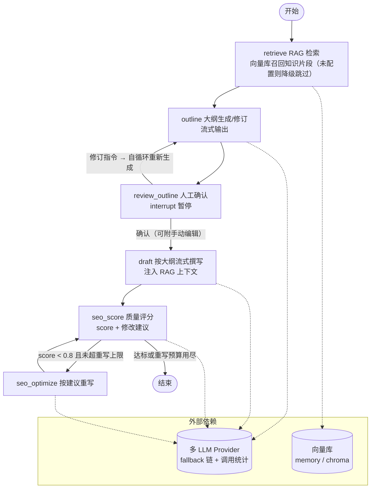

# LangGraph SEO Blog

基于 **LangGraph** 的 AI SEO 博客生成器：输入一个主题，走完 **知识库检索（RAG）→ 大纲生成 → 人工确认/对话式修订（interrupt）→ 流式撰写 → SEO 评分 ⇄ 自动重写** 的完整工作流，全程 SSE 实时推送。配套多 LLM Provider 管理与故障自动转移层。


## ✨ 功能特性

- **LangGraph 状态图工作流**：`retrieve → outline → review_outline → draft → seo_score ⇄ seo_optimize`，条件边 + 循环重写 + 人工介入 + 断点续跑
- **Human-in-the-loop 大纲确认**：`interrupt` 暂停后，用户可以确认、手动编辑标题/大纲，或用自然语言下修订指令让模型重新生成（对话式修订自循环）
- **SEO 质量闭环**：draft 后由 `seo_score` 节点按关键词覆盖/结构/内容深度评分，低于阈值自动回到 `seo_optimize` 按建议重写并复评；重写次数有上限，不会死循环
- **RAG 知识检索**：内置 SEO 语料一键入库；SQLite 存权威文档与分块，向量索引可插拔（默认 `InMemoryVectorStore` 零依赖，`VECTOR_STORE=chroma` 切换 Chroma 持久化），重启后索引自动重建；检索片段带来源，注入撰写 prompt 做引用溯源
- **多 LLM Provider 管理**：Provider CRUD / 连通性测试 / 模型列表自动发现 / 按节点路由 / fallback 链；**API Key 只存用户浏览器本地，后端不留存**
- **故障自动转移（FallbackChatModel）**：认证失败 / 限流 / 超时 / 5xx 自动切换候选 Provider，4xx 业务错误立即抛出；**流式模式下仅首 token 产生前允许切换**；每次尝试写入调用统计与 failover 链路
- **SSE 流式输出**：大纲 token、正文 token、SEO 评分、RAG 检索结果全部以自定义事件实时推送，SEO 重写时前端可见修订稿逐字覆盖旧稿
- **调用统计**：按 Provider / 按节点的调用量、成功率、token、延迟、failover 次数，独立统计页展示
- **Tavily 联网选题研究**：独立端点返回结构化选题简报（受众 / 搜索意图 / 内容角度 / 竞品缺口 / 推荐大纲）
- **前后端分离 monorepo**：FastAPI + SQLAlchemy；React 19 + antd 6 + @ant-design/x

## 🧠 架构总览


```mermaid
flowchart TD
    START([开始]) --> retrieve["retrieve RAG 检索<br/>向量库召回知识片段（未配置则降级跳过）"]
    retrieve --> outline["outline 大纲生成/修订<br/>流式输出"]
    outline --> review_outline["review_outline 人工确认<br/>interrupt 暂停"]
    review_outline -- "修订指令 → 自循环重新生成" --> outline
    review_outline -- "确认（可附手动编辑）" --> draft["draft 按大纲流式撰写<br/>注入 RAG 上下文"]
    draft --> seo_score["seo_score 质量评分<br/>score + 修改建议"]
    seo_score -- "score < 0.8 且未超重写上限" --> seo_optimize["seo_optimize 按建议重写"]
    seo_optimize --> seo_score
    seo_score -- "达标或重写预算用尽" --> END([结束])

    subgraph 外部依赖
        llm[("多 LLM Provider<br/>fallback 链 + 调用统计")]
        vector_db[("向量库<br/>memory / chroma")]
    end

    outline -.-> llm
    draft -.-> llm
    seo_score -.-> llm
    seo_optimize -.-> llm
    retrieve -.-> vector_db
```

## LangGraph 核心设计

| LangGraph 能力 | 项目中的应用 |
| --- | --- |
| `StateGraph` + 类型化 State | `TypedDict(total=False)` 定义 `BlogState`：主题、大纲、RAG 片段、正文、SEO 分数等 |
| 普通边 / 条件边 | 线性主干 + 两个路由函数：`route_after_review`（修订自循环）、`route_after_seo_score`（重写循环） |
| `interrupt` + `Command(resume=...)` | 大纲确认暂停/恢复；同一 `thread_id` 支持多轮「修订 → 再确认」 |
| Checkpointer（MemorySaver） | 按 `thread_id` 保存执行快照，中断后可恢复 |
| `StreamWriter` 自定义事件 | `outline_token / article_token / seo_token / seo_score / rag_context` 直通 SSE |
| 流式降级边界 | LLM 层流式调用仅在首 token 前允许切换 Provider，见下文 |

### State 与图构建

```python
# backend/app/graph.py
class BlogState(TypedDict, total=False):
    topic: str
    keyword: str
    rag_sources: list[dict]        # retrieve 节点召回，带 title/source/score
    title: str
    outline: list[str]
    instruction: str               # 修订指令，驱动 outline 自循环
    article: str
    seo_score: float
    seo_suggestions: list[str]
    seo_revisions: int             # 重写预算计数

builder.add_edge(START, "retrieve")
builder.add_edge("retrieve", "outline")
builder.add_edge("outline", "review_outline")
builder.add_conditional_edges("review_outline", route_after_review,
                              {"outline": "outline", "draft": "draft"})
builder.add_edge("draft", "seo_score")
builder.add_conditional_edges("seo_score", route_after_seo_score,
                              {"seo_optimize": "seo_optimize", END: END})
builder.add_edge("seo_optimize", "seo_score")

graph = builder.compile(checkpointer=MemorySaver())
```

```python
# SEO 循环路由：达标放行；不足且还有预算才重写，杜绝死循环
SEO_SCORE_THRESHOLD = 0.8
MAX_SEO_REVISIONS = 2

def route_after_seo_score(state: BlogState) -> str:
    below = state.get("seo_score", 1.0) < SEO_SCORE_THRESHOLD
    within = state.get("seo_revisions", 0) < MAX_SEO_REVISIONS
    return "seo_optimize" if below and within else END
```

### Human-in-the-loop：对话式大纲确认

`review_outline` 节点用 `interrupt` 暂停并把当前标题/大纲抛给前端；恢复时按 resume 载荷分流——`revise` 带修订指令回到 `outline` 重新生成（可多轮），`approve` 可附带用户手动编辑后的标题/大纲直接进入撰写：

```python
decision = interrupt({"title": state["title"], "outline": state["outline"]})
if decision.get("action") == "revise":
    return {"instruction": decision["instruction"]}      # → 条件边回到 outline
return {"title": decision.get("title") or state["title"],
        "outline": decision.get("outline") or state["outline"]}
```

### RAG 管道

权威数据与索引分离：文档和分块持久化在 SQLite（`knowledge_docs` / `knowledge_chunks`），向量索引只是可重建的缓存——`memory` 索引重启即失，首次检索时自动从 SQLite 重建；`chroma` 则自带持久化。

- 切块：`RecursiveCharacterTextSplitter(800/120)`；入库保留 `title/source` 元数据做引用溯源
- 检索：`retrieve` 节点按「主题 + 关键词」召回 Top-4，注入撰写 prompt 作为事实依据
- 降级：`EMBEDDING_PROVIDER` 未配置或向量库故障时，`retrieve` 静默跳过，**不阻塞生成主流程**（有测试覆盖）
- 内置语料：`backend/data/corpus/*.md`（SEO 基础 / 关键词研究 / 内容结构），`POST /api/rag/seed` 幂等导入；前端「知识库」页支持添加/删除文档与检索测试

### 多 LLM Provider 与故障自动转移

`FallbackChatModel`（`app/llm/fallback.py`）按候选链顺序尝试调用，是本项目的工程核心：

- **可降级异常精确分类**：认证失败 / 限流 / 超时 / 5xx 才切换候选；其余 4xx 业务错误立即抛出，不浪费重试。状态码沿 `__cause__` 异常链递归提取
- **流式降级边界**：仅首 token 产生前的失败允许切换；已经开始向用户输出后失败直接报错，避免内容重复/错乱
- **异步流跨线程消费**：`_drain_async_stream` 用独立事件循环 + 守护线程 + 队列把 async 流统一成同步迭代器，异常原样上抛
- **调用统计**：每次尝试（含失败）记录 token / 延迟 / `failover_from` 链路到 `llm_calls` 表；错误信息脱敏后入库与展示
- **Key 不落地**：Provider 的 API Key 只存用户浏览器 localStorage，随请求传入、仅本次构建使用，后端不留存（仅以哈希参与模型实例缓存键）

候选链解析优先级：请求指定 Provider > 节点级路由（`node_routing`）> 全局默认 > fallback 链；全部未配置时回退环境变量模式。

## 📁 项目结构

```
langgraphseoblog/
├── backend/
│   ├── app/
│   │   ├── main.py                # FastAPI 入口（lifespan 建表 + 轻量迁移）
│   │   ├── graph.py               # StateGraph：节点、条件边、SEO 循环、SSE 事件
│   │   ├── outline.py / seo.py    # 各节点 prompt 构造与模型输出解析
│   │   ├── research.py            # Tavily 选题研究（独立端点）
│   │   ├── db.py / models.py      # SQLAlchemy：Provider / 设置 / 调用统计 / 知识库
│   │   ├── api/
│   │   │   ├── routes.py          # Provider/设置/统计/RAG/工作流(SSE) 路由
│   │   │   └── schemas.py         # Pydantic 请求/响应模型
│   │   ├── llm/
│   │   │   ├── fallback.py        # FallbackChatModel 故障转移层
│   │   │   ├── factory.py         # Provider → ChatModel 工厂（热更新缓存）
│   │   │   ├── resolver.py        # 候选链解析（指定 > 节点路由 > 默认 > fallback）
│   │   │   ├── model_catalog.py   # Provider 类型目录 + 模型列表自动发现
│   │   │   └── stats.py           # 调用统计落库与脱敏
│   │   ├── rag/
│   │   │   ├── service.py         # 知识库服务：入库/检索/删除/索引重建/向量库切换
│   │   │   └── embeddings.py      # EMBEDDING_PROVIDER → Embeddings（OpenAI 兼容）
│   │   └── search/tavily.py       # Tavily 搜索适配
│   ├── data/corpus/               # 内置 RAG 示例语料（一键导入）
│   └── tests/                     # 36 个测试：图流程 / SSE / RAG / 降级 / 工厂 / 研究
├── frontend/src/
│   ├── pages/                     # 博客生成 / 知识库 / Provider 管理 / 调用统计
│   └── api/                       # 后端 API 客户端封装（含 SSE 解析）
└── tasks/                         # Spec 驱动开发：PRD → SPEC → 9 个 issue
```

## 🚀 快速开始

### 环境要求

- Python ≥ 3.11（后端，使用 [uv](https://docs.astral.sh/uv/) 管理）
- Node.js ≥ 20（前端）
- 至少一个 LLM 的 API Key（页面上配置并保存在浏览器本地，或走环境变量）

### 启动后端（端口 8000）

```bash
cd backend
uv sync                # 如需 Chroma 向量库：uv sync --extra chroma
uv run uvicorn app.main:app --reload
```

### 启动前端（端口 5173，`/api` 已代理到后端）

```bash
cd frontend
npm install
npm run dev
```

### 配置

复制 `backend/.env.example` 为 `backend/.env`，按需配置：

| 变量 | 说明 | 默认值 |
| --- | --- | --- |
| `LLM_PROVIDER` | 环境变量回退模式：`openai` / `anthropic` / `ark` | `openai` |
| `EMBEDDING_PROVIDER` | RAG 向量化：`openai` / `ark`（OpenAI 兼容协议）；**不配置则 RAG 关闭，主流程不受影响** | 未设置 |
| `EMBEDDING_MODEL` | embedding 模型名 | `text-embedding-3-small` |
| `VECTOR_STORE` | `memory`（默认，零依赖）/ `chroma`（需 `--extra chroma`） | `memory` |

Provider 与 API Key 推荐直接在前端「Provider 管理」页配置（Key 仅存浏览器本地）；系统未配置任何 Provider 时回退到上面的环境变量模式。

## API 概览

| 方法 | 路径 | 说明 |
| --- | --- | --- |
| `GET` | `/api/health` | 健康检查 |
| `POST` | `/api/blog/threads` | 启动工作流（SSE）：RAG 检索 → 大纲 → interrupt 暂停 |
| `POST` | `/api/blog/threads/{id}/resume` | 恢复工作流（SSE）：`revise` 修订大纲 / `approve` 确认并撰写 + SEO 循环 |
| `POST` | `/api/research/topic` | Tavily 联网选题研究，返回结构化简报 |
| `GET` / `POST` | `/api/rag/documents` | 知识库文档列表 / 入库（自动切分） |
| `DELETE` | `/api/rag/documents/{id}` | 删除文档（同步清理向量索引） |
| `POST` | `/api/rag/search` | 知识库检索（带来源与相似度） |
| `POST` | `/api/rag/seed` | 幂等导入内置语料 |
| `GET` | `/api/rag/status` | RAG 状态：是否启用 / 向量库类型 / 文档与分块数 |
| `GET` / `POST` / `PATCH` / `DELETE` | `/api/providers` | Provider CRUD（含连通性测试、模型列表发现） |
| `GET` / `PUT` | `/api/settings/llm` | 默认 Provider / fallback 链 / 节点级路由 |
| `GET` | `/api/llm/stats` `/api/llm/calls` | 按 Provider/节点聚合的调用统计与明细 |

## 测试

```bash
cd backend && uv run pytest     # 36 个测试：图流程(interrupt/修订/SEO 循环)、SSE、RAG、降级边界、工厂与解析
cd frontend && npm run build    # 前端类型检查 + 构建
```

工作流测试使用 FakeWrapper 模拟逐 token 流式输出，按节点与调用次序返回不同结果（如 SEO 评分第一次 0.5、复评 0.9），无需真实 API Key；RAG 测试用确定性假 embedding 驱动 `InMemoryVectorStore`。

## 🗺️ Roadmap

- [ ] 持久化 Checkpointer（`langgraph-checkpoint-sqlite`），进程重启后可恢复中断线程
- [ ] 基于大纲的 `Send` API 并行分节撰写 + 全文组装
- [ ] 把 `/api/research/topic` 接入工作流（research 节点），选题简报进入大纲上下文
- [ ] MCP 双向集成：后端暴露 MCP Server 工具；研究节点消费外部 MCP 搜索工具
- [ ] 文章发布导出（Markdown / Front Matter）与文章库管理
- [ ] RAG 评分引用校验（生成内容与引用片段的一致性检查）

## License

[MIT](./LICENSE)
